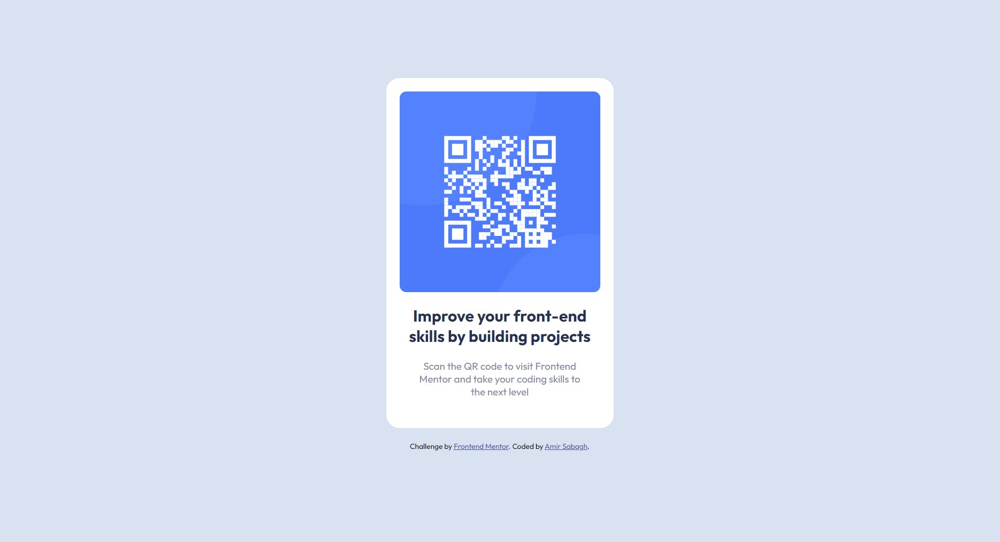
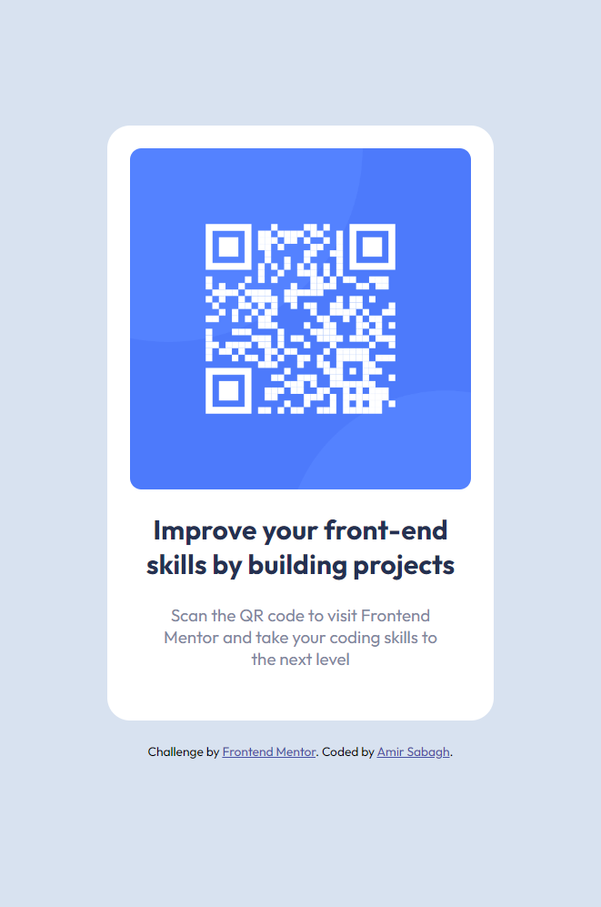

# Frontend Mentor - QR code component solution

This is a solution to the [QR code component challenge on Frontend Mentor](https://www.frontendmentor.io/challenges/qr-code-component-iux_sIO_H). Frontend Mentor challenges help you improve your coding skills by building realistic projects. 

## Table of contents

- [Overview](#overview)
  - [Screenshot](#screenshot)
  - [Links](#links)
- [My process](#my-process)
  - [Built with](#built-with)
  - [What I learned](#what-i-learned)
  - [Continued development](#continued-development)
  - [Useful resources](#useful-resources)
- [Author](#author)
- [Acknowledgments](#acknowledgments)

## Overview

### Screenshot

#### Desktop

#### Mobile

### Links

- Solution URL: [Link](https://github.com/amir-the6th/QR-Code)
- Live Site URL: [Add live site URL here](https://your-live-site-url.com)

## My process

### Built with

- Semantic HTML5 markup
- CSS custom properties
- Flexbox

### What I learned

The major accomplishment of this prject was learning more about the power of flexbox. I used <code>display: flex;</code> to:
- Organize the image and the texts in a column
- Place the QR code container in the middle of the screen

## Author

- Website - [Amir Sabagh](https://arsenicolos.com)
- Frontend Mentor - [@amir-the6th](https://www.frontendmentor.io/profile/amir-the6th)
- GitHub - [@amir-the6th](https://github.com/amir-the6th)

## Acknowledgments

I want to give a shout out to the [Scrimba](https://scrimba.com) CEO and professor, [Per Harald Borgen](https://twitter.com/perborgen). I have recently finished the [HTML and CSS course](https://scrimba.com/learn/htmlandcss) in Scrimba and the things I learned there helped me a lot and enabled me to finish this challenge in less than 30 minutes.
